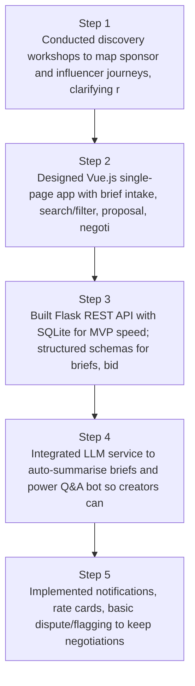
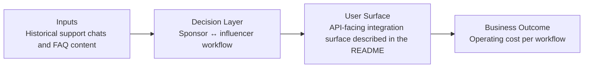
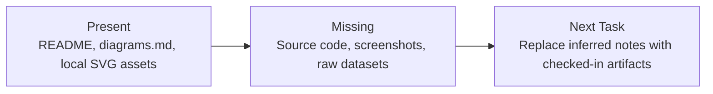

# SponsorSync Influencer Marketplace Diagrams

Generated on 2026-04-26T04:29:37Z from README narrative plus project blueprint requirements.

## Marketplace architecture (Vue + Flask + SQLite)

## Sponsor ↔ influencer workflow

## Evidence Gap Map

